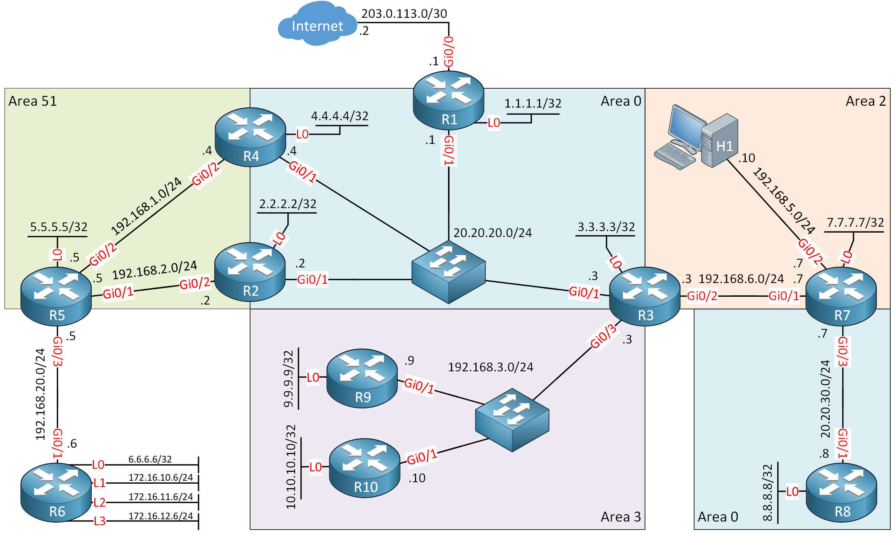

# ab-agent

一个面向网络排障场景的智能 Agent 项目，包含：
- `agent/`：排障 Agent 核心逻辑（推理、工具调用、状态管理）
- `web_ui.py`：本地 Web 交互界面（拓扑解析 + 对话排障 + Trace/Log/Commands/Report）
- `agent_chat.py`：命令行对话入口
- `netpilot-mcp/`：网络设备 MCP 服务（Telnet/SSH、跨厂商驱动、结构化输出）
- `scripts/`：启动与 UI 测试脚本

## 项目结构

```text
ab-agent/
├── agent/                  # Agent核心代码
├── netpilot-mcp/           # MCP工具服务（设备连接/执行命令/诊断）
├── scripts/                # 辅助脚本（启动、测试）
├── web_ui.py               # Web UI入口
├── agent_chat.py           # CLI入口
├── TOPO_QUES.MD            # 拓扑与题目信息
├── ospf-professional-lab-1.png
└── CleanShot 2026-03-02 at 16.58.57@2x.png
```

## 快速启动（小白从零版）

### 0) 你需要准备

- 一台可联网电脑（macOS / Linux）
- 已安装 Python 3.10+
- API Key：
  - `ZHIPU_API_KEY`（文本排障）
  - `PPIO_API_KEY`（拓扑图片解析，可选）

### 1) 一条命令启动（推荐）

在项目根目录执行：

```bash
bash scripts/quick_start.sh
```

这个脚本会自动完成：
- 创建并使用 `.venv` 虚拟环境
- 安装依赖（`netpilot-mcp` + `openai`）
- 若没有 `.env`，自动从 `.env.example` 生成
- 检查 API Key 是否为空并给出提示
- 启动 Web UI（默认 `http://127.0.0.1:8787`）

### 2) 首次配置 API Key

如果脚本提示 Key 为空，编辑 `.env`：

```bash
ZHIPU_API_KEY=你的文本模型Key
PPIO_API_KEY=你的视觉模型Key（可选）
```

保存后再次执行：

```bash
bash scripts/quick_start.sh
```

### 3) 其他启动方式（可选）

- 仅启动 Web：`python3 web_ui.py`
- CLI 对话：`python3 agent_chat.py`

## 测试内容整理（OSPF 故障注入）

### 1) 测试拓扑



### 2) 测试目标

- 验证在链路故障场景下，Agent 是否能定位 `6.6.6.6` 到 `8.8.8.8` 不通问题。

### 3) 故障注入步骤

- 手动关闭 R3 的 `g0/1` 接口：

```bash
R3# configure terminal
R3(config)# interface g0/1
R3(config-if)# shutdown
```

### 4) 故障现象

- 业务表现：`6.6.6.6` 到 `8.8.8.8` 不通（Ping 失败）。
- 预期排障方向：检查 R3 到 Area 2 方向链路、OSPF 邻接与路由可达性。

### 5) 最终效果


> 说明：图片文件名包含空格，Markdown 中使用 URL 编码路径。

## 相关脚本

- `scripts/quick_start.sh`：从零一键准备环境并启动 Web UI（推荐）
- `scripts/start_web_with_open.sh`：启动 Web UI 并自动打开浏览器
- `scripts/pm2_start.sh` / `scripts/pm2_stop.sh`：PM2 管理服务
- `scripts/ui_chat_test.js`：Playwright UI 对话测试脚本
